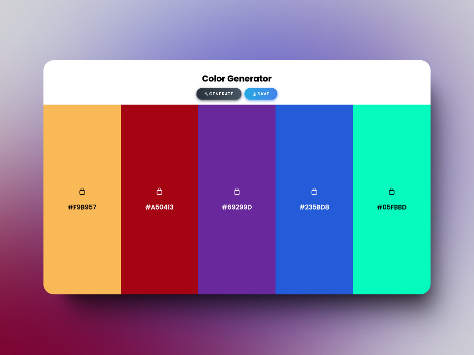

# Random Color Palette

## Generate colors and get palettes!

_You can either [click here](https://gregorim04.github.io/random-color-palette/) or the picture above to see the live site._

### The Project
This project fixed a recurrent question I used to have when coding a new site: **Which colors should I use now?**

So, I basically divided this project into three main blocks and figured the rest out on the road:

- **Main layout:** This site is meant to be used on Desktop devices. However, it is always good to have a nice view when accessing it from mobile devices. So, I kept the layout as simple as possible on both mobile and desktop, with just a couple of buttons to interact.

- **Main functionality:** The site should generate random colors, allow you to copy individual hex color codes, and allow you to go back if you pass any interesting ones. Also, you should be able to lock any color and keep getting new ones.

- **Download option:** The site should be able to save a PNG file with all the colors shown and their respective hex codes below each one.

### Problems encountered
There were a few issues I got after coding the main layout and functionality:

1. _Colors are hiding their hex name:_ This one was pretty simple. Hex names should be colored so they are visible in contrast with their own colors. It was solved via a function that calculates which option, black or white, should be used to color a hex name based on the brightness of their representative colors. Here's [the solution](https://stackoverflow.com/questions/11867545/change-text-color-based-on-brightness-of-the-covered-background-area).

2. _How to download the palette:_ This one came to the fact that there is no way to "download" an HTML tag without using an external library or any browser extension. However, it was possible to download a **canvas** element. So, I basically coded an entire section in JS to create, download, and remove a canvas element with all colors on display.

3. _How to go-back to previous colors:_ Pretty funny one. I tried to modify the URL using all the generated colors. However, you cannot redirect the page to a non-existing location using the pushState Js method. That made me realize I don't know how the HTTP protocol and servers work yet. So, I saved all generated colors by palettes in the browser history without adding colors to the current URL.

4. _Lock colors while saving palettes?:_ The last issue created the need to save all palettes somewhere besides the browser's history. I used an empty array to save them all during the current session. That way, I can always maintain any locked color while also being able to access previous ones if needed.

### Improvements
This project has many improvement areas and cool features that can be added like:

- An option to manually change a generated color by adjusting the brightness or opacity of each one.
- An option to rearrange color in the layout by dragging and dropping.
- A way to save colors in the URL so the palette can be saved as a link and shared with others.
- Add tooltips to help with the interface (for example, you can generate new colors by pressing the spacebar on the keyboard).
- Use better code implementation when using JS functions.
- Etc.

Nonetheless, the way it is now helps me to answer the question I initially had: Which colors should I use now? :)